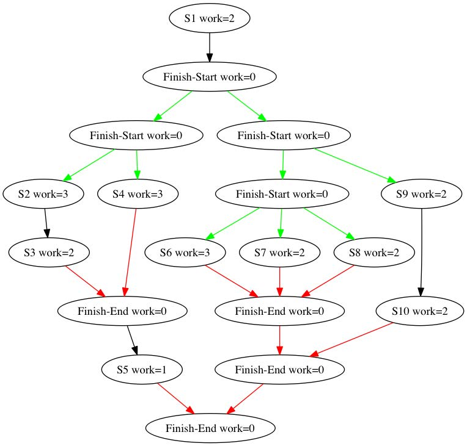
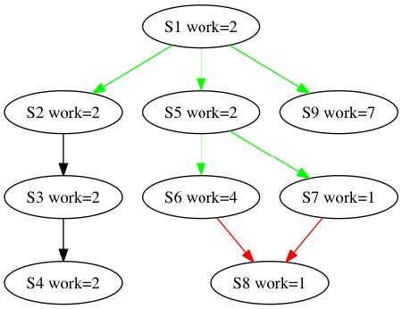
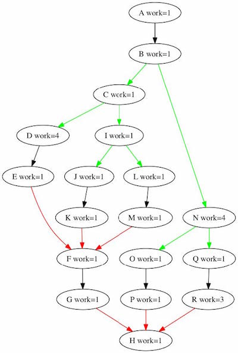

1. Consider the following parallel pseudo-code that uses the async-finish notation for task creation and termination
   introduced in Lecture 1.1:
    ```java
    finish {
      async S1;
      finish {
        async S2;
        S3;
      }
      S4;
    }
    S5;
    ```
   Which of the following statements are true? Check all that apply

<ol type="A">
  <li>🟢 S2 can potentially execute in parallel with S3 </li>
  <li>S2 can potentially execute in parallel with S4</li>
  <li>🟢 S1 can potentially execute in parallel with S4 </li>
  <li>S1 can potentially execute in parallel with S5</li>
</ol>

2. Consider the following parallel pseudo-code that uses the async-finish notation for task creation and termination
   introduced in Lecture 1.1:

   ```java
   S1;
   finish {async S2;}
   S3;
   ```

   The line "finish {async S2;}" could be equivalently replaced by which of the following? You may assume that S1, S2,
   and S3 do not spawn any nested async tasks.

   Check all that apply

<ol type="A">
  <li>async S2</li>
  <li>async finish S2</li>
  <li>🟢 S2</li>
  <li>🟢 finish S2</li>
</ol>

3. Consider the computation graph in Figure 1 below (where black, green and red arrows represent continue, fork, and
   join edges respectively, as explained in Lecture 1.3).
   

   What is the total WORK for the computation graph in Figure 1? Please enter an integer.
   > 22


4. What is the SPAN or CPL (critical path length) for the computation graph in Figure 1? Please enter an integer.
   > 8


5. Consider the computation graph in Figure 2 below (where black, green and red arrows represent continue, fork, and
   join edges respectively, as explained in Lecture 1.3).
   

   For the computation graph in Figure 2, identify which of the following paths are critical paths?

   Check all that apply

<ol type="A">
   <li>S1 \rightarrow→ S2 \rightarrow→ S3 \rightarrow→ S4</li>
   <li>S1 \rightarrow→ S5 \rightarrow→ S8</li>
   <li>🟢 S1 \rightarrow→ S5 \rightarrow→ S6 \rightarrow→ S8</li>
   <li>S1 \rightarrow→ S5 \rightarrow→ S7 \rightarrow→ S8</li>
   <li>🟢 S1 \rightarrow→ S9</li>
</ol>

6. Recall that the concepts of WORK and SPAN were introduced in Lecture 1.3. Consider the pseudo-code in Figure 3 below
   for adding two lower triangular matrices
   (square matrices in which all the elements above and including the (0,0) to (n,n) diagonal are zero), in which each
   execution of the statement `A[i][j] = B[i][j] + C[i][j]`; represents one unit of work in the computation graph, WORK(
   S5) = 1:

   ```java 
   // figure 3: 
   finish {
     for (int i = 0; i < n; i++) {
       async {
         for (int j = 0; j < i; j++) {          
           A[i][j] = B[i][j] + C[i][j];        
         } // for-j      
       } // async
     } // for-i  
   }
   ```

The total WORK performed by the program in Figure 3 (after it completes execution), in terms of nn equals __________.
<ol type="A">
   <li>1</li>
   <li>n-1</li>
   <li>🟢 $\frac{n(n-1)}{2} $</li>
   <li>None of the above</li>
</ol>

7. The Critical Path Length (CPL) of the program in Figure 3 in terms of nn equals __________.

<ol type="A">
   <li>1</li>
   <li>🟢 n-1</li>
   <li>$\frac{n(n-1)}{2} $</li>
   <li>None of the above</li>
</ol>

8. Recall that Ideal Parallelism was also defined in Lecture 1.3. The Ideal Parallelism of the program in Figure 3, as a
   function of nn equals _________.

   ```java
   finish {    
         for (int i = 0; i < n; i++) {      
           async {        
             for (int j = 0; j < i; j++) {          
               A[i][j] = B[i][j] + C[i][j];        
             } // for-j      
           } // async    
         } // for-i  
       } // finish
   ```

<ol type="A">
   <li>🔴 1</li>
   <li>🟢 $\frac{n}{2}$</li>
   <li>🔴 n-1</li>
   <li>🔴 None of the above</li>
</ol>

9. Recall that multiprocessor schedules were introduced in Lecture 1.4. Though, by default, we focus on schedules with
   no unforced idleness in this course, this question will allow for all possible legal schedules, including those that
   may have unforced idleness, i.e., schedules in which a process may be idle even if there is work that is available to
   be executed.

   Consider the computation graph shown below in Figure 4. Select the statement below that is true about legal schedules
   for this graph on 3 processors.
   

<ol type="A">
   <li></li>
   <li>🟢 There exists a legal schedule in which node P can complete execution before node C starts. </li>
   <li></li>
</ol>

10. For an arbitrary computation graph and its schedule on P processors, which of the following relationships must
    always hold between Speedup(P) and Ideal Parallelism?

> B. Speedup(P) ≤ Ideal Parallelism